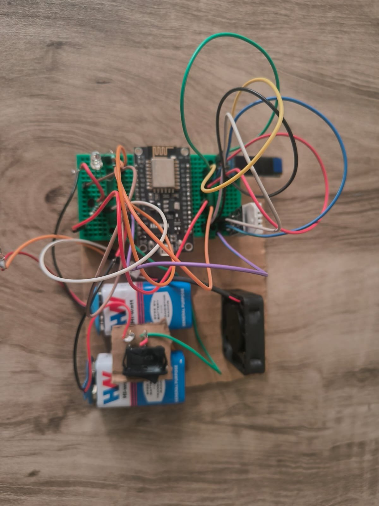
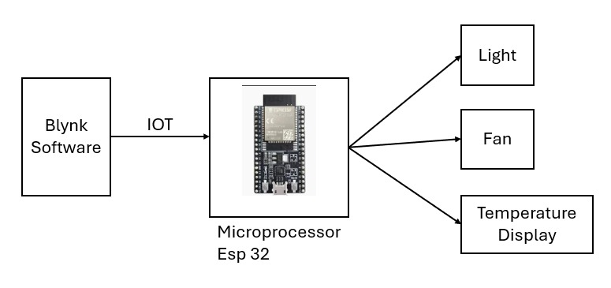

# Smart Home Automation using ESP8266

## Project Overview

This project demonstrates a Smart Home Automation system developed using the ESP8266 NodeMCU microcontroller and an ultrasonic sensor. The system detects the distance of an object using the ultrasonic sensor and automatically adjusts the brightness of LEDs based on the measured distance. The project is designed as a simple IoT-based automation system that shows how sensors, microcontrollers, and wireless communication can work together to create intelligent home solutions.

The ESP8266 microcontroller connects to the internet through WiFi and communicates with the Blynk IoT platform. This allows the system to send real-time data to a mobile application where users can monitor the sensor readings remotely. The project demonstrates how IoT can be used to automate basic home functions and improve convenience.

---

## Hardware Components

The system is built using several basic electronic components. The main controller used in this project is the ESP8266 NodeMCU microcontroller, which handles sensor readings and internet connectivity. An HC-SR04 ultrasonic sensor is used to measure the distance between the sensor and nearby objects. Four LEDs are connected to the microcontroller to represent lighting that changes intensity depending on the distance detected by the sensor.

Additional components such as resistors, jumper wires, a breadboard or prototype board, and a 9V battery power supply are used to complete the circuit. These components together form a simple hardware setup that demonstrates the concept of smart automation.

---

## Software Requirements

The software used for this project includes the Arduino IDE, which is used to write and upload the code to the ESP8266 NodeMCU board. The ESP8266 board package and the Blynk library are installed within the Arduino IDE to enable communication with the Blynk IoT platform. The Blynk mobile application is used to visualize the sensor data and monitor the system remotely through a smartphone.

---

## Working Principle

The working of this system begins with the ultrasonic sensor continuously measuring the distance between the sensor and nearby objects. The ESP8266 microcontroller receives this data and processes it using the program written in the Arduino IDE. Based on the measured distance, the system adjusts the brightness of the connected LEDs using PWM signals. When the object is closer to the sensor, the brightness of the LEDs changes accordingly.

At the same time, the distance value is transmitted through WiFi to the Blynk IoT platform. This allows the user to observe the sensor data in real time using the Blynk mobile application. The integration of sensors, wireless connectivity, and mobile monitoring demonstrates the concept of a simple smart home automation system.

---

## Pin Configuration

The ultrasonic sensor is connected to the ESP8266 NodeMCU using two digital pins. The trigger pin of the ultrasonic sensor is connected to pin D5, while the echo pin is connected to pin D6. Four LEDs are connected to pins D0, D1, D2, and D3 of the microcontroller. These LEDs change their brightness depending on the detected distance. The ultrasonic sensor receives power from the 3.3V pin of the ESP8266 and shares a common ground with the microcontroller.

---

## Hardware Setup

The following image shows the actual hardware implementation of the Smart Home Automation system. The setup includes the ESP8266 NodeMCU, ultrasonic sensor, LEDs, and power supply connected on a prototype board.

---

## Circuit Diagram

The circuit diagram below illustrates how the ultrasonic sensor and LEDs are connected to the ESP8266 NodeMCU microcontroller.

---

## Project Demonstration

The project demonstration video shows the working of the system where the ultrasonic sensor detects distance and controls the LED brightness accordingly. The video also demonstrates how the system sends data to the Blynk platform for real-time monitoring.

Demo Video:
[Watch the demo video](project_demo.mp4)

---

## Features

This project demonstrates an IoT-based smart automation system capable of measuring distance and adjusting LED brightness automatically. The system also supports wireless monitoring through the Blynk platform, allowing users to observe sensor data remotely. The project is designed to be simple, low-cost, and suitable for learning the fundamentals of IoT and embedded systems.

---

## Future Improvements

The system can be further improved by integrating additional sensors such as temperature, humidity, or motion sensors to create a more advanced smart home environment. Future versions of the project could also include voice assistant integration with platforms like Amazon Alexa or Google Assistant. Another improvement could involve developing a dedicated mobile application for controlling home appliances and monitoring energy usage.

---

